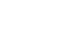
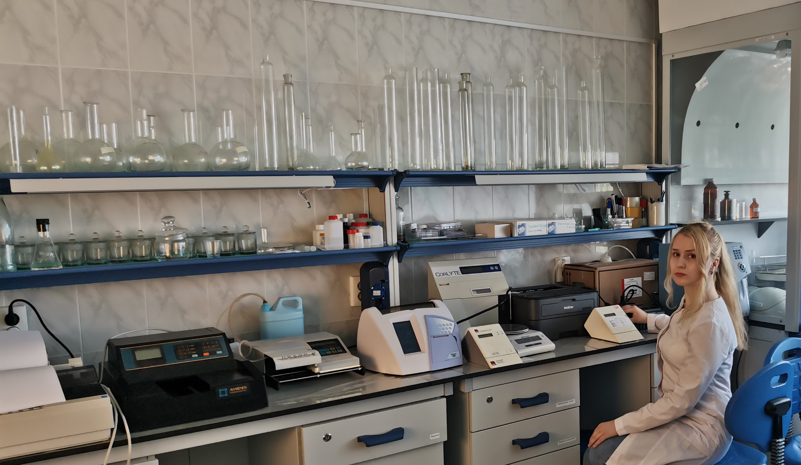

<!DOCTYPE html>
<html>
<head>
	<meta charset="UTF-8">
	<meta name="viewport" content="width=device-width, initial-scale=1.0">
	<meta name="description" content="" />
	<title>Кафедра общей и клинической биохимии №2 РостГМУ</title>
	<link rel="apple-touch-icon" sizes="180x180" href="favicon/apple-touch-icon.png">
	<link rel="icon" type="image/png" sizes="32x32" href="favicon/favicon-32x32.png">
	<link rel="icon" type="image/png" sizes="16x16" href="favicon/favicon-16x16.png">
	<link rel="manifest" href="favicon/site.webmanifest">
	<link rel="mask-icon" href="favicon/safari-pinned-tab.svg" color="#5bbad5">
	<link rel="shortcut icon" href="favicon/favicon.ico">
	<meta name="msapplication-TileColor" content="#da532c">
	<meta name="msapplication-config" content="favicon/browserconfig.xml">
	<meta name="theme-color" content="#ffffff">
	<link href="style-one.css" rel="stylesheet" type="text/css">

</head>
<body>
	<header class="header">
		
		

			

				

					
				

				<nav class="header_nav">
					<ul class="header-list">
						<li class="header-item">
							<a href="#Articles" class="header-link js-scroll">Кафедра сегодня</a>
						</li>
						<li class="header-item">
							<a href="#Locations" class="header-link js-scroll">Наука</a>
						</li>
						<li class="header-item">
							<a href="#Videos" class="header-link js-scroll">Видео</a>
						</li>
						<li class="header-item">
							<a href="#Sign in" class="header-link js-scroll">Главная</a>
						</li>
					</ul>
					

						
						
					

				</nav>
				

					
					
					
				

			

		

	</header> 
	<main class="main">
		

			

				<h1 class="intro_title">
					Кафедра общей и клинической биохимии №2 РостГМУ
				</h1>
				<!--  

		Jump off balcony, onto stranger's head. Chase ball of string hide when guests come over. Being gorgeous with belly side up i could pee on this if i had the energy but under the bed, for attack the child, open the door,
	
-->
				<form class="search_form">
					<fieldset class="search_form_wrap">
						

							<input type="text" name="user like to do" class="search_form_field" placeholder="What would you like to do?" />
							<input type="text" name="user like to go" class="search_form_field" placeholder="Where would you like to go?" />
							<button type="submit" class="search_form_submit">
								search
							</button>
						

					</fieldset>
				</form>
			

		

		<section class="benefits">
			

				<h2 class="benefits_title">
					Наша деятельность
				</h2>
				

					

						

							
						

						<h3 class="benefits_card-title">
							Анализы
						</h3>
						

							Перечень анализов и правтических навыков, проводящихся в лаборатории кафедры
						

						<a class="benefits_card-more" href="!#">
							УЗНАТЬ БОЛЬШЕ
						</a>
					

					

						

							
						

						<h3 class="benefits_card-title">
							Наука
						</h3>
						

							На нашей кафедре непрерывно вёдятся научнач работа. Наши студенты неоднократно становились призерами ИНК РостГМУ.
						

						<a class="benefits_card-more" target="blank" href="https://vk.com/snk_biochem2">
							УЗНАТЬ БОЛЬШЕ
						</a>
					

					

						

							
						

						<h3 class="benefits_card-title">
							Студентам
						</h3>
						

							Материалы для подготовки к занятиям. Дополнительная информация
						

						<a class="benefits_card-more" href="#Para">
							УЗНАТЬ БОЛЬШЕ
						</a>
					

				

			

		</section>

		<section class="places" id="Articles">
			

				

					<h2 class="places-title section-title">
						Кафедра сегодня
					</h2>

				

				

					<figure class="places-card places-card-size-lg">
						

					</figure>

					<figure class="places-card places-card-size-lg">
						

					</figure>

					<figure class="places-card places-card-size-sm">
						

					</figure>

					<figure class="places-card places-card-size-sm">
						

					</figure>

					<figure class="places-card places-card-size-sm">
						

					</figure>

				

			

		</section>

		

			

				

					

						
					

					

						<h3 class="tour-title">Студенческая лаборатория</h3>
						
В нашей лаборатории студенты выполняют практические задания, осваивают навыки, необходимые для будущей специальности

						<a href="!#" class="tour-link">ТЕХНИКА БЕЗОПАСНОСТИ</a>
					

				

				

					

						<h3 class="tour-title">Наука и лаборатория</h3>
						
На базе кафедральной лаборатории студенты, ординаторы и аспиранты проводять собственные научные исследования, ставят опыты и публикуют свои работы

						<a href="!#" class="tour-link">О РАБОТЕ С БИОМАТЕРИОЛОМ</a>
					

					

						
					

				

			

		

		<section class="top" id="Locations">
			

				<h2 class="section-title top-title">Наука на кафедре</h2>

				

					

						

							

						

						

							Молекулярная биология, химия и медицина. Сборник 2017 год.

						

						<a href="./Sbornik-2017.pdf" alt="Today top places to visit" target="_blank" class="top-card-more">СКАЧАТЬ</a>
					

					

						

							

						

						

							Молекулярная биология, химия и медицина. Сборник 2018 год.

						

						<a href="./Sbornik-2018.pdf" alt="Today top places to visit" target="blank" class="top-card-more">СКАЧАТЬ</a>
					

					

						

							

						

						

							Молекулярная биология, химия и медицина. Сборник 2019 год.

						

						<a href="./Sbornik-2019.pdf" alt="Today top places to visit" target="blank" class="top-card-more">СКАЧАТЬ</a>
					

					

						

							

						

						

							Молекулярная биология, химия и медицина. Сборник 2020 год.

						

						<a href="./Sbornik-2020.pdf" alt="Today top places to visit" target="blank" class="top-card-more">СКАЧАТЬ</a>
					

					

						

							

						

						

							Молекулярная биология, химия и медицина. Сборник 2021 год.

						

						<a href="./Sbornik-2021.pdf" alt="Today top places to visit" target="blank" class="top-card-more">СКАЧАТЬ</a>
					

					

						

							

						

						

							Молекулярная биология, химия и медицина. Сборник 2022 год.

						

						<a href="!#" alt="Today top places to visit" target="blank" class="top-card-more">СКАЧАТЬ</a>
					

				

			

		</section>

		<!-- videos start -->

		

			

				

				<iframe class="video-el" src="https://www.youtube.com/embed/j5buhQzhyEU" title="YouTube video player" frameborder="0" allow="accelerometer; autoplay; clipboard-write; encrypted-media; gyroscope; picture-in-picture" allowfullscreen></iframe>
			

		

		<!-- videos end -->
		<!-- para start -->

		<section class="para" id="Para">
			

				<h2 class="section-title top-title">Студентам</h2>

				<h3 class="section-title top-title">Вопросы по биохимии для студентов ЛПФ и УВЦ</h3>

				

					

						

							
Свойства ферментов

							<ol class="QS">

								<li> Ферменты: определение, сравнение со свойствами неорганических катализаторов. Энергетический профиль реакции, энергия активации.</li>
								<li> Уровни структурной организации ферментов (протомеры, олигомеры, мультиферментные комплексы, ферментные ансамбли)</li>
								<li> Классификация ферментов по составу. Роль кофактора и апофермента.</li>
								<li> Структура фермента: активный и аллостерический центры.</li>
								<li> Механизм ферментативного катализа.</li>
								<li> Основы кинетики ферментативных реакций: зависимость скорости ферментативной реакции от концентрации: фермента, субстрата, температуры, рН.</li>
								<li> Специфичность действия ферментов: субстратная (абсолютная, относительная, стереоспецифичность) и каталитическая.</li>
								<li> Единицы измерения активности ферментов.</li>
								<li> Номенклатура и классификация ферментов.</li>
							</ol>
							<a class="benefits_card-more" href="https://www.youtube.com/watch?v=MMwqeBA73t0" id="QS-link" target="blank">
								ОБУЧАЮЩИЙ ФИЛЬМ
							</a>
						

						

							
Регуляция активности ферментов

							<ol class="QS">

								<li> Регуляция скорости ферментативных реакций:</li>
								<ul>
									<li>изменением количества фермента;</li>
									<li>доступностью молекул субстрата и кофермента;</li>
									<li>локализацией ферментов в определенном отсеке клетки</li>
									<li>(компартментализация);</li>
								</ul>
								<li> Регуляция активности ферментов:</li>
								<ul>
									<li>частичным (ограниченным протеолизом).</li>
									<li>с помощью белок-белковых взаимодействий.</li>
									<li>путем фосфорилирования/дефосфорилирования.</li>
								</ul>
								<li> Аллостерические ферменты: определение, особенности строения и функционирования.</li>
								<li> Типы ингибирования ферментов: (необратимое, обратимое, конкурентное, неконкурентное).</li>
								<li> Энзимодиагностика. Изоферменты.</li>
								<li> Использование ферментов в медицине.</li>
							</ol>
							<a class="benefits_card-more" href="https://www.youtube.com/watch?v=0hO0ZdlfXPk" id="QS-link" target="blank">
								ОБУЧАЮЩИЙ ФИЛЬМ
							</a>
						

						

							
Общий путь катаболизма веществ

							<ol class="QS">

								<li> Понятия об обмене веществ: определение, типы (внешний и промежуточный), метаболиты, метаболические пути (линейные, циклические, спиральные).</li>
								<li> Катаболизм основных пищевых веществ - углеводов, жиров, белков (схема).</li>
								<li> Окислительное декарбоксилирование ПВК: локализация, строение мульти-</li>
								<li> ферментного комплекса, последовательность реакций.</li>
								<li> Цикл Кребса (ЦТК): локализация, последовательность реакций, ферменты, коферменты. Схема цикла Кребса</li>
								<li> Биологическая роль общего пути катаболизма. Анаплеротические реакции.</li>
								<li> Регуляция общего пути катаболизма.</li>
							</ol>
							<a class="benefits_card-more" href="https://www.youtube.com/watch?v=Tl3aHUNd-fM" id="QS-link" target="blank">
								ОБУЧАЮЩИЙ ФИЛЬМ
							</a>
							<a class="benefits_card-more" href="https://www.youtube.com/watch?v=vmsMILCKGFU" id="QS-link" target="blank">
								ОБУЧАЮЩИЙ ФИЛЬМ
							</a>
						

						

							
Энергетический обмен.   Дыхательная цепь митохондрий

							<ol class="QS">

								<li> Биологическое окисление. Пути использования кислорода.</li>
								<li> Этапы тканевого дыхания. Пути синтеза АТФ: субстратное и окислительное фосфорилирование.</li>
								<li> Цепь переноса электронов: локализация, основные принципы и механизмы функционирования.</li>
								<li> Комплексы ЦПЭ, общая схема.</li>
								<li> Хемиоосмотическая теория Митчелла. Трансмембранный электрохимический потенциал как промежуточная форма энергий при окислительном фосфорилировании.</li>
								<li> Н+-зависимая АТФ-синтетаза: строение, роль в синтезе АТФ.</li>
								<li> Коэффициент окислительного фосфорилирования. Дыхательный контроль.</li>
								<li> Разобщение тканевого дыхания и окислительного фосфорилирования. Ингибиторы ферментов ЦПЭ.</li>
								<li> Связь между общим путем катаболизма и дыхательной цепью.</li>
							</ol>
							<a class="benefits_card-more" href="https://www.youtube.com/watch?v=iK9R4gVNZCM" id="QS-link" target="blank">
								ОБУЧАЮЩИЙ ФИЛЬМ
							</a>
							<a class="benefits_card-more" href="https://www.youtube.com/watch?v=YUIO8E5tTwE&t=185s" id="QS-link" target="blank">
								ОБУЧАЮЩИЙ ФИЛЬМ
							</a>
						

						

							
Структура и функции биологических мембран.  Введение в биохимию гормонов

							<ol class="QS">

								<li> Мембраны клетки: функции, строение, свойства.</li>
								<li> Липидный состав мембран, роль в формировании липидного бислоя.</li>
								<li> Белки мембран - интегральные, поверхностные, «заякоренные».</li>
								<li> Механизмы переноса веществ через мембраны: простая диффузия, первично-активный транспорт (Na+-K+-АТФ-аза), симпорт и антипорт, вторично-активный транспорт (глю/ Na+).</li>
								<li> Сигнальные молекулы - гормоны: определение, классификация по: химическому строению, биологическому действию, характеристика.</li>
								<li> Рецепторы: определение, характеристика, классификация.</li>
								<li> Понятие о G-белках, общая схема передачи сигнала через рецепторы, сопряженные с G-белками.</li>
								<li> Трансмембранная передача сигнала с участием систем: аденилатциклазной, инозитолтрифосфатной</li>
								<li> Передача сигнала через рецепторы, обладающие ферментативной активностью.</li>
								<li> Передача сигнала через ядерные рецепторы (цитозольный механизм)</li>
							</ol>
							<a class="benefits_card-more" href="https://www.youtube.com/watch?v=Efgp67YWJkA" id="QS-link" target="blank">
								ОБУЧАЮЩИЙ ФИЛЬМ
							</a>
						

						

							
Углеводы: функции, переваривание в ЖКТ. Обмен гликогена, регуляция, нарушения

							<ol class="QS">

								<li> Основные углеводы пищи: функции, суточная потребность.</li>
								<li> Переваривание углеводов в ЖКТ: этапы процесса, ферменты.</li>
								<li> Всасывание моносахаридов через стенку ЖКТ и особенности их транспорта в клетки различных тканей.</li>
								<li> Нарушение переваривания и всасывания углеводов.</li>
								<li> Судьба глюкозо-6-фосфата в клетках тканей организма человека.</li>
								<li> Биосинтез гликогена (гликогеногенез): схема процесса, ферменты.</li>
								<li> Распад гликогена (гликогенолиз): схема процесса, ферменты. Особенности распада гликогена в печени и скелетных мышцах.</li>
								<li> Регуляция обмена гликогена.</li>
								<li> Гликогеновые болезни: гликогенозы и агликогенозы.</li>
							</ol>
							<a class="benefits_card-more" href="https://www.youtube.com/watch?v=qjQcUxdtcYQ" id="QS-link" target="_blank">
								ОБУЧАЮЩИЙ ФИЛЬМ
							</a>

						

						

							
Пути распада глюкозы: гликолиз (аэробный и анаэробный).   пентозофосфатный путь

							<ol class="QS">

								<li> Гликолиз: основные этапы, последовательность реакций, ферменты, значение.</li>
								<li> Анаэробный гликолиз: основные этапы, ферменты и последовательность реакций, биологическая роль.</li>
								<li> Челночные механизмы переноса НАДН из цитозоля в митохондрии (малатаспартатная и α-глицерофосфатная челночная системы).</li>
								<li> Энергетический эффект: аэробного окисления глюкозы, анаэробного гликолиза.</li>
								<li> Пентозофосфатный путь окисления глюкозы (ПФП): характеристика, этапы, последовательность реакций окислительной ветви, ферменты, биологическая роль.</li>
								<li> Схема реакций неокислительной ветви ПФП, ферменты, биологическое значение.</li>
								<li> Регуляция пентозофосфатного пути, его связь с гликолизом</li>
								<li> Наследственные нарушения пентозофосфатного пути.</li>
								<li> Цель занятия: систематизировать современные сведения об основных путях распада глюкозы в организме человека для понимания особенностей метаболизма глюкозы в различных органах и тканях в норме и патологии.</li>
							</ol>
							
						

						

							
Синтез глюкозы из веществ неуглеводной природы - глюконеогенез, регуляция. Обмен фруктозы и галактозы, нарушения

							<ol class="QS">

								<li> Глюконеогенез: характеристика процесса, субстраты, локализацияпроцесса, биологическое значение.</li>
								<li> Необратимые реакции гликолиза и глюконеогенеза;</li>
								<li> Общие реакции гликолиза и глюконеогенеза.</li>
								<li> Схема глюконеогенеза в организме человека, этапы, ферменты.</li>
								<li> Синтез глюкозы из лактата и глицерина, аминокислот. Циклы: Кори и глюкозо-аланиновый.</li>
								<li> Регуляция процессов гликолиза и глюконеогенеза.</li>
								<li> Обмен фруктозы в печени. Фруктоземия.</li>
								<li> Обмен галактозы в печени. Галактоземия.</li>
								<li> Пути нарушения обмена углеводов в организме человека: гипер- и гипогликемия: причины, компенсация. Глюкозотолерантный тест.</li>
							</ol>
							
						

						

							
Липиды: функции, переваривание 1-й ресинтез. Транспорт экзогенных жиров

							<ol class="QS">

								<li> Липиды организма человека: структура, функции.</li>
								<li> Переваривание пищевых жиров в ЖКТ: этапы, роль        желчных кислот в процессе эмульгирования.</li>
								<li> Гидролиз пищевых жиров.  Роль колипазы.</li>
								<li> Образование мицелл, всасывание продуктов переваривания, энтерогепатическая циркуляция.</li>
								<li> Ресинтез жиров в слизистой оболочке тонкого кишечника.</li>
								<li> Обмен хиломикронов, роль липопротеинлипазы</li>
								<li> Нарушение переваривания и всасывания жиров – стеаторея: виды,  лабораторная диагностика.</li>
							</ol>
							<a class="benefits_card-more" href="https://www.youtube.com/watch?v=cyD49QTe_SM" id="QS-link" target="_blank">
								ОБУЧАЮЩИЙ ФИЛЬМ
							</a>
						

						

							
Биосинтез ВЖК, ТАГ, регуляция. Роль ЛОНП в транспорте жиров

							<ol class="QS">

								<li> Синтез ВЖК: характеристика процесса, транспорт ацетилКоА в цитозоль, образование малонил-Ко.</li>
								<li> Строение синтазы жирных кислот.</li>
								<li> Реакции синтеза жирных кислот.</li>
								<li> Представление о синтезе удлиненных и ненасыщенных ВЖК. Регуляция синтеза ВЖК.</li>
								<li> II-й ресинтез липидов: субстраты, ферменты, последовательность реакций.</li>
								<li> Синтез фосфолипидов:  последовательность реакций, взаимопревращения глицерофосфолипидов, регуляция. Липотропные факторы.</li>
								<li> Транспортная форма эндогенных жиров – ЛОНП: состав, метаболизм.</li>
								<li> Сурфактант: структура, биологическая роль.</li>
								<li> Транспортная форма эндогенных жиров – ЛПОНП: состав, метаболизм.</li>
							</ol>
							
						

						

							
Распад ТАГ, фосфолипидов, ВЖК,регуляция.       Эйкозаноиды: строение и биологическая роль. Обмен кетоновых тел. Кетонемия, кетонурия, причины   их развития

							<ol class="QS">

								<li> Особенности структуры и метаболизма веществ в белой и бурой жировой тканях.</li>
								<li> Мобилизация жиров, гормональная регуляция. Роль перилипина.</li>
								<li> Окисление жирных кислот:  активация ВЖК, их транспорт в митохондрии, роль карнитина.</li>
								<li> β-Окисление жирных кислот: реакции процесса, ферменты, регуляция.</li>
								<li> Энергетический эффект β-окисления. Регуляция процесса.</li>
								<li> Окисление ВЖК с нечетным числом углеродов и непредельных. Понятие о других видах окисления ВЖК.</li>
								<li> Синтез кетоновых тел, регуляция.</li>
								<li> Использования кетоновых тел как источника энергии различными тканями.</li>
								<li> Схема обмена кетоновых тел. Кетоацидоз.</li>
							</ol>
							
						

						

							
Белки как источники аминокислот

							<ol class="QS">

								<li> Белки: полноценные и неполноценные. Азотистый баланс, нормы белка в питании.  Квашиоркор.</li>
								<li> Общая характеристика и схема переваривания белков в ЖКТ.</li>
								<li> Желудочная фаза переваривания: роль и механизм образования соляной кислоты; пепсины (А и С): активация и специфичность действия.</li>
								<li> Поджелудочная фаза переваривания: регуляция секреции, активация проферментов, их специфичность действия.   Острый панкреатит: молекулярные основы заболевания, лабораторная диагностика.</li>
								<li> Кишечная фаза переваривания. Особенности переваривания белков у детей.</li>
								<li> Механизмы всасывания АК, ди- и трипептидов: Na-зависимый, γ-глутамильный, Н+-зависимый.</li>
								<li> Наследственные нарушения транспорта АК: цистинурия, болезнь Хартнупа, лабораторная диагностика.</li>
								<li> Распад эндогенных белков с участием систем: лизосомальной, убиквитин-протеасомной и кальпаин-кальпастатиновой.</li>
								<li> Ингибиторы протеаз в качестве лекарственных препаратов.</li>
							</ol>
							<a class="benefits_card-more" href="https://www.youtube.com/watch?v=y-Ytd3DTbF0" id="QS-link" target="_blank">
								ОБУЧАЮЩИЙ ФИЛЬМ
							</a>
						

						

							
Общие пути обмена аминокислот.   Биосинтез мочевины

							<ol class="QS">

								<li> Аминокислотный пул: пути образования и использования аминокислот.</li>
								<li> Трансаминирование АК: ферменты, номенклатура, общий вид реакции, коферменты, значение.   Механизм действия  витамина В6. Использование аминотрансфераз в энзимодиагностике.</li>
								<li> Причины, этапы распада АК.</li>
								<li> Окислительное дезаминирование глу: ферменты, коферменты, значение.</li>
								<li> Трансдезаминирование: схема процесса, значение. Роль глутаматдегидроге-назы.</li>
								<li> Окисление D-АК: ферменты, коферменты, схема реакции.</li>
								<li> Неокислительное дезаминирование АК: примеры, ферменты.</li>
								<li> Обмен аммиака: функции, источники, образование нетоксичных форм хранения.</li>
								<li> Транспорт аммиака из тканей, его выведение, причины токсичности аммиака.</li>
								<li> Синтез мочевины: реакции, ферменты, регуляция, взаимосвязь с ЦТК.</li>
								<li> Наследственные нарушения синтеза мочевины, лабораторная диагностика.</li>
							</ol>
							<a class="benefits_card-more" href="https://www.youtube.com/watch?v=2rw-vjFVS9M" id="QS-link" target="_blank">
								ОБУЧАЮЩИЙ ФИЛЬМ
							</a>
						

						

							
Распад АК. Синтез заменимых АК

							<ol class="QS">

								<li> Представление о распаде АК, глюкогенные и кетогенные АК.</li>
								<li> Распад углеродного скелета аминокислот (ала, цис, сер, тре, гли) до пирувата: реакции, ферменты, нарушения.</li>
								<li> Распад углеродного скелета аминокислот (асн, асп) до оксалоацетата: реакции, ферменты.</li>
								<li> Распад углеродного скелета аминокислот (фен, тир) до фумарата и ацетоацетата: реакции, ферменты, нарушения.</li>
								<li> Распад углеродного скелета аминокислот (глу, глн, арг, гис, про) до  a-оксоглутарата: реакции, ферменты, нарушения.</li>
								<li> Распад углеродного скелета аминокислот (мет, тре,  иле, вал)  до сукцинил-КоА: реакции, ферменты, нарушения.</li>
								<li> Распад углеродного скелета аминокислот (три, лей, лиз)  до ацетил-КоА или ацетоацетата: реакции, ферменты, нарушения.</li>
								<li> Синтез заменимых АК (ала, асп, асн, глу, глн) из промежуточных продуктов ЦТК: реакции, ферменты.</li>
								<li> Синтез заменимых АК (ала, асп, асн, глу, глн, сер) из их предшественников: реакции, ферменты.</li>
							</ol>
							
						

						

							
Аминокислоты как предшественники низкомо-лекулярных азотсодержащих соединений

							<ol class="QS">

								<li> Тетрагидрофолиевая кислота как переносчик одноуглеродных фрагментов: состав, образование транспортных форм, их взаимосвязь, нарушения, лаб. диагностика.</li>
								<li> S-аденозилметионин как донор метильной группы: образование транспортной формы, метильный цикл, функции, нарушения.</li>
								<li> Витамин В12 как переносчик метильной группы: состав,    образование транспортной формы, функции, нарушения, лаб. диагностика.</li>
								<li> Реакции гидроксилирования: механизм действия и образование активной формы биоптерина.</li>
								<li> Реакции декарбоксилирования: образование биогенных аминов, их обезвреживание, примеры.</li>
								<li> Тирозин как предшественник катехоламинов и меланина, функции катехоламинов, нарушения обмена фен и тир (альбинизм, болезнь Паркинсона)</li>
								<li> Триптофан как предшественник серотонина и мелатонина: их синтез, функции, нарушения.</li>
								<li> Аргинин как предшественник полиаминов, креатина, оксида азота: их синтез, функции, нарушения.</li>
								<li> Глутатион: синтез, функции, нарушения.</li>
								<li> Особенности метаболизма АК в кишечнике, печени и скелетных мышцах.</li>
							</ol>
							
						

						

							
Обмен нуклеотидов

							<ol class="QS">

								<li> Нуклеиновые кислоты: классификация, структура компонентов, входящих в их состав. Функции нуклеотидов.</li>
								<li> Схема переваривания нуклеопротеинов.</li>
								<li> Синтез пуриновых нуклеотидов: этапы, схема, ферменты, регуляция, запасные пути синтеза.</li>
								<li> Схема распада пуриновых нуклеотидов: схема, ферменты.</li>
								<li> Нарушения обмена пуриновых нуклеотидов: гиперурикемия, синдром Леша-Нихана. Молекулярные основы лечения подагры.</li>
								<li> Биосинтез пиримидиновых нуклеотидов: схема, ферменты, регуляция, нарушения (оротацидурия).</li>
								<li> Превращение рибонуклеотидов в дезоксиформу.</li>
								<li> Распад пиримидиновых нуклеотидов: схема, ферменты.</li>
							</ol>
							<a class="benefits_card-more" href="https://www.youtube.com/watch?v=lTxkVPkOsgo" id="QS-link" target="_blank">
								ОБУЧАЮЩИЙ ФИЛЬМ
							</a>
						

						

							
Матричные биосинтезы: репликация,  репарация, транскрипция

							<ol class="QS">

								<li> Репликация – синтез ДНК: матрица, затравка, субстраты, кофактор, ферменты и белки репликации</li>
								<li> Основные повреждения в ДНК и их репарация</li>
								<li> Транскрипция – синтез РНК: субстраты, кофактор. РНК-полимераза. Обратная транскрипция</li>
								<li> Процессинг РНК: посттранскрипционные превращения различных типов РНК</li>
								<li> Генетический код и его свойства. Значение тРНК в декодировании.</li>
							</ol>
							<a class="benefits_card-more" href="https://www.youtube.com/watch?v=4mo8yVotzgY" id="QS-link" target="_blank">
								ОБУЧАЮЩИЙ ФИЛЬМ
							</a>
						

						

							
Матричные биосинтезы: трансляция. Теория оперона

							<ol class="QS">

								<li> Биосинтез белка (трансляция): основные этапы функционирования белоксинтезирующей системы (инициация, элонгация, терминация)</li>
								<li> Посттрансляционные изменения полипептидных цепей и образование функционально-активных белков</li>
								<li> Регуляция экспрессии генов у прокариот и эукариот. Теория оперона</li>
								<li> Ингибиторы матричных биосинтезов, применение в медицине</li>
								<li> Механизмы генетической изменчивости. Полиморфизм белков. Наследственные болезни.</li>
							</ol>
							<a class="benefits_card-more" href="https://www.youtube.com/watch?v=EvLy_1_Y3tk" id="QS-link" target="_blank">
								ОБУЧАЮЩИЙ ФИЛЬМ
							</a>
						

						

							
СРО в норме и при патологии. Апоптоз

							<ol class="QS">

								<li> Свободнорадикальное окисление: характеристика, значение в норме и патологии, пути образования активных форм кислорода.</li>
								<li> Перекисное окисление липидов (ПОЛ): субстраты, продукты ПОЛ, стадии, механизмы повреждающего действия (перекисная гипотеза гибели клеток).</li>
								<li> Ферментативная и неферментативная антиоксидантная система (АОС) организма.</li>
								<li> «Программированная клеточная гибель»: биологическое значение, классификация и сравнительная характеристика различных видов гибели клеток.</li>
								<li> Апоптоз: трансмембранные и внутриклеточные стимулы, стадии, роль каспаз, Ca2+ и Mg2+ -зависимых эндонуклеаз, белка Р53 в развитии апоптоза клетки.</li>
								<li> Молекулярные механизмы клеточной гибели: внешний, внутренний и перфорингранзимный пути реализации клеточной гибели.</li>
								<li> Нарушения апоптоза и их роль в механизмах развития опухолевого роста, аутоиммунных заболеваний и дегенеративных процессов.</li>
							</ol>
							
						

						

							
Биохимические основы канцерогенеза

							<ol class="QS">

								<li> Опухоли: определение, классификация, признаки доброкачественных и злокачественных опухолей. Теории онкогенеза.</li>
								<li> Основные положения современной полиэтиологической теории канцерогенеза.</li>
								<li> Канцерогены: определение, свойства, классификация, гены-мишени. Онкогены и онкобелки: характеристика и  роль в канцерогенезе.</li>
								<li> Последствия повреждения ДНК клетки канцерогенами.</li>
								<li> Химический канцерогенез.</li>
								<li> Радиационный кацерогенез.</li>
								<li> Вирусный канцерогенез.</li>
								<li> Особые  свойства опухолевых клеток и механизм их приобретения.</li>
								<li> Биохимические изменения метаболизма в опухолевых клетках.</li>
								<li> Принципы диагностики, лечения и профилактики злокачественных новообразований.</li>
							</ol>
							<a class="benefits_card-more" href="https://www.youtube.com/watch?v=INqMGWZYuBs" id="QS-link" target="_blank">
								ОБУЧАЮЩИЙ ФИЛЬМ
							</a>
						

						

							
Биохимия питания. Биороль макро- и микроэлементов

							<ol class="QS">

								<li> Понятие о нутриоме: характеристика основных пищевых веществ: суточная потребность, биологическая роль. Незаменимые или эссенциальные нутриенты (примеры).</li>
								<li> Биохимические основы питания человека: питание как основа жизнедеятельности организма, освобождение энергии из пищевых веществ (переход энергии пищевых веществ в энергию АТФ).</li>
								<li> Взаимопревращения белков, углеводов и липидов в организме.</li>
								<li> Основные принципы рационального питания человека.</li>
								<li> Алиментарные заболевания: определение, классификация. Наиболее распространенные первичные и вторичные расстройства питания.</li>
								<li> Болезни с алиментарными факторами развития патологии.</li>
								<li> Общая характеристика минеральных элементов в организме человека: классификация и функции</li>
								<li> Биологическая роль отдельных макро- и микроэлементов элементов в организме человека</li>
							</ol>
							
						

						

							
Биохимия жирорастворимых витаминов

							<ol class="QS">

								<li> Витамины: определение, классификация, общая характеристика, роль в организме.</li>
								<li> Обмен витаминов в организме человека: особенности всасывания в ЖКТ  и транспорта в крови. Роль печени в обмене витаминов.</li>
								<li> Возможные пути развития эндогенной витаминной недостаточности.</li>
								<li> Антивитамины: классификация, механизм действия, примеры. Использование в медицине.</li>
								<li> Витамин А: химическая природа, медицинское название, суточная потребность, источники, биологическая роль. Гипо- и авитаминозы.</li>
								<li> Витамин Е: химическая природа, медицинское название, суточная потребность, источники, биологическая роль. Гипо- и авитаминозы.</li>
								<li> Витамин К: химическая природа, медицинское название, суточная потребность, источники, биологическая роль. Гипо- и авитаминозы.</li>
								<li> Витамин Д: химическая природа, медицинское название, суточная потребность, источники, схема синтеза в организме, биологическая роль. Гипо- и авитаминозы.</li>
							</ol>
							<a class="benefits_card-more" href="https://www.youtube.com/watch?v=TBNCqRCsSvY" id="QS-link" target="_blank">
								ОБУЧАЮЩИЙ ФИЛЬМ
							</a>
						

						

							
Биохимия водорастворимых витаминов

							<ol class="QS">

								<li> Витамин B1: химическая природа, суточная потребность, источники, коферментная форма, биологическая роль. Гипо- и авитаминозы.</li>
								<li> Витамин B2: химическая природа, суточная потребность, источники, коферментная форма, биологическая роль. Гипо- и авитаминозы.</li>
								<li> Витамин В6: химическая природа, суточная потребность, источники коферментные формы, биологическая роль (участие в реакциях трансаминирования и декарбоксилирования аминокислот). Гипо- и авитаминозы</li>
								<li> Витамин РР: химическая природа, суточная потребность, источники, коферментные формы, участие в окислительно-восстановительных реакциях. Гипо- и авитаминозы</li>
								<li> Витамин С: химическая природа, медицинское название, суточная потребность, источники, биологическая роль. Гипо- и авитаминозы.</li>
								<li> Витамин В12: химическая природа, медицинское название, суточная потребность, источники, коферментные формы, участие в обмене аминокислот. Гипо- и авитаминозы.</li>
								<li> Витамин Н: химическая природа, медицинское название, суточная потребность, источники, биологическая роль. Гипо- и авитаминозы.</li>
							</ol>
							
						

						

							
Интеграция метаболизма

							<ol class="QS">
								<li> Понятие об обмене веществ: определение, типы (внешний и промежуточный),   метаболиты, метаболические пути (линейные, циклические, спиральные), значение.</li>
								<li> Общая схема обмена веществ в организме</li>
								<li> Механизмы регуляции обмена веществ:</li>
								<ul>
									<li>изменение количества ферментов</li>
									<li>регуляция активности ферментов</li>
									<li>компартментализация</li>
									<li>челночные механизмы</li>
									<li>регуляция с участием мембран</li>
								</ul>
								<li> Иерархия регуляторных систем в организме</li>
								<li> Возможность взаимосвязи обмена веществ:</li>
								<ul>
									<li>наличие общих промежуточных продуктов</li>
									<li>возможность взаимопревращений через общие метаболиты</li>
									<li>использование общих коферментов</li>
									<li>наличие общего пути катаболизма и единой системы освобождения энергии (схема)</li>
									<li>наличие сходных механизмов регуляции</li>
								</ul>
								<li> Направление потока ключевых метаболитов между различными метаболическими путями (гормональная регуляция)</li>
								<li> Взаимосвязь различных видов обмена веществ (общая схема)</li>
								<li> Пути использования аминокислот и глицерола для биосинтеза глюкозы и гликогена, аминокислот и глюкозы для образования липидов, глицерола и глюкозы для синтеза заменимых аминокислот.</li>
								<li> Интеграция метаболизма за счет взаимодействия основных органов и тканей организма человека:</li>
								<ul>
									<li>печени и жировой ткани</li>
									<li>печени  и скелетных мышц.</li>
									<li>печени и головного мозга.</li>
									<li>печени и почек.</li>
								</ul>
							</ol>
							
						

						

							
Регуляторные системы организма. Биохимия стероидных гормонов

							<ol class="QS">

								<li> Понятие о регуляторных системах в организме человека. Иерархия регуляторных систем в организме человека.</li>
								<li> Гормоны: определение, свойства, классификация по химическому строению и функциям, биологическая роль.</li>
								<li> Связь гормонов с ЦНС (схема). Положительная  и отрицательная обратная связь в регуляции образования и действия гормонов.</li>
								<li> Общая схема механизмов передачи гормональных сигналов в клетки-мишени (мембранно-внутриклеточный и цитозольный).</li>
								<li> Системы передачи гормонального  сигнала в клетки-мишени: аденилатциклазная, инозитолфосфатная, гуанилатциклазная.</li>
								<li> Стероидные гормоны: классификация, общая схема биосинтеза, катаболизм.</li>
								<li> Гормоны коры надпочечников – глюкокортикоиды: химическая природа, структура, регуляция синтеза и секреции (гипоталамо-гипофизарно-надпочечниковая ось), механизм действия, транспорт, клетки-мишени, влияние  на обмен веществ, катаболизм.</li>
								<li> Биохимические изменения при гипер- и гипокортицизме.</li>
								<li> Мужские половые гормоны: локализация и этапы биосинтеза, химическая природа, регуляция синтеза и секреции, транспорт, механизм действия, биологические эффекты, катаболизм.</li>
								<li> Женские половые гормоны: локализация и этапы биосинтеза, химическая природа, регуляция синтеза и секреции, транспорт, механизм действия, биологические эффекты, катаболизм.</li>
							</ol>
							<a class="benefits_card-more" href="https://www.youtube.com/watch?v=Q4PtWwt8qKQ" id="QS-link" target="_blank">
								ОБУЧАЮЩИЙ ФИЛЬМ
							</a>
							<a class="benefits_card-more" href="https://www.youtube.com/watch?v=DIYpqiQJipU" id="QS-link" target="_blank">
								ОБУЧАЮЩИЙ ФИЛЬМ
							</a>
						

						

							
Биохимия гормонов - производных АК: адреналин и    тиреоидные  гормоны

							<ol class="QS">

								<li> Катехоламины: химическая природа, структура, локализация и  этапы биосинтеза, катаболизм.</li>
								<li> Адреналин: клетки-мишени и механизм действия, регуляция секреции (гипоталамо-симпато-адреналовая ось).</li>
								<li> Влияние адреналина на обмен веществ в организме.</li>
								<li> Тиреоидные гормоны: химическая природа, этапы биосинтеза, транспорт и катаболизм.</li>
								<li> Регуляция синтеза и секреции йодтиронинов (гипоталамо-гипофизарно-тиреоидная  ось), транспорт в крови, клетки-мишени, механизм действия.</li>
								<li> Влияние йодтиронинов на обмен веществ в физиологических (нормальных) концентрациях.</li>
								<li> Биохимические изменения при гипер- и гипофункции щитовидной железы.</li>
							</ol>
							<a class="benefits_card-more" href="https://www.youtube.com/watch?v=zIdnDUtmTU4" id="QS-link" target="_blank">
								ОБУЧАЮЩИЙ ФИЛЬМ
							</a>
						

						

							
Биохимия гормонов пептидной и белковой природы

							<ol class="QS">

								<li> Инсулин: химическая природа, структура, этапы биосинтеза, катаболизм.</li>
								<li> Механизм действия инсулина, клетки-мишени, характеристика рецепторов, субстраты инсулинового рецептора.</li>
								<li> Регуляция синтеза и секреции инсулина.</li>
								<li> Влияние инсулина на обмен веществ в организме.</li>
								<li> Глюкагон: биосинтез, клетки-мишени, механизм действия, влияние на метаболизм.</li>
								<li> Гормоны гипоталамуса: классификация, химическая природа, клетки-мишени, механизм действия, биологическая роль.</li>
								<li> Гормоны гипофиза: классификация, химическая природа, клетки-мишени, механизм действия, биологическая роль.</li>
								<li> Соматотропный гормон (гормон роста): химическая природа, клетки-мишени, регуляция секреции, механизм действия, биологическая роль, нарушение синтеза и секреции.</li>
							</ol>
							
						

						

							
Молекулярные механизмы развития и течения сахарного диабета

							<ol class="QS">
								<li> Сахарный диабет: определение, факторы риска, классификация.</li>
								<li> Характеристика основных типов сахарного диабета: причины развития абсолютной и относительной инсулиновой недостаточности.</li>
								<li> Метаболический синдром и инсулинорезестентность: характеристика, биохимические механизмы развития.</li>
								<li> Биохимические процессы, лежащие в основе развития клинических симптомов сахарного диабета.</li>
								<li> Биохимические механизмы развития острых осложнений сахарного диабета.</li>
								<li> Биохимические механизмы развития хронических осложнений сахарного диабета.</li>
								<li> Лабораторная диагностика и критерии скрининга сахарного диабета.</li>
							</ol>
							<a class="benefits_card-more" href="https://www.youtube.com/watch?v=YUIO8E5tTwE&t=189s" id="QS-link" target="_blank">
								ОБУЧАЮЩИЙ ФИЛЬМ
							</a>
						

						

							
Биохимия   форменных элементов крови.  Белки плазмы крови Обмен железа в организме. Анемии

							<ol class="QS">
								<li>Белки плазмы крови: основные признаки, классификация, функции, характеристика отдельных представителей основных классов.</li>
								<li>Белки острой фазы воспаления: биологическая роль, классификация, механизмы повышения их уровня в крови, характеристика отдельных представителей, значение для диагностики заболеваний.</li>
								<li>Биохимия эритроцитов: функции, особенности структуры, химического состава и метаболизма веществ (особенности гликолиза, роль пентозофосфатного пути).</li>
								<li>Взаимосвязь обмена глюкозы и системы антиоксидантной защиты в эритроцитах (схема).</li>
								<li>Гемоглобин: функции, строение, виды, отличие от миоглобина.</li>
								<li>Связывание гемоглобина с кислородом: триггерный механизм, кооперативный аллостерический эффект, кривые насыщения гемоглобина и миоглобина кислородом.</li>
								<li>Сродство гемоглобина к кислороду и его регуляция (эффект Бора, влияние 2,3-дифосфоглицерата).</li>
								<li>Схема транспорта кислорода и углекислого газа гемоглобином.</li>
								<li>Биосинтез гема в организме человека: локализация, субстраты, ферменты, этапы и регуляция. Порфирии.</li>
								<li> Особенности метаболизма фагоцитирующих лейкоцитов.</li>
								<li> Обмен железа в организме: общий пул железа в организме и его использование, особенности всасывания в кишечнике, транспорта в крови, поступления в клетки, депонирования и регуляции.</li>
								<li> Нарушение обмена железа в организме: биохимические основы развития железодефицитной анемии и гемохроматоза, лабораторная диагностика.</li>
							</ol>
							<a class="benefits_card-more" href="https://www.youtube.com/watch?v=uRZoBHPNj-w" id="QS-link" target="_blank">
								ОБУЧАЮЩИЙ ФИЛЬМ
							</a>
							<a class="benefits_card-more" href="https://www.youtube.com/watch?v=iJG6x618L3M" id="QS-link" target="_blank">
								ОБУЧАЮЩИЙ ФИЛЬМ
							</a>
						

						

							
Биохимия свертывающей и противосвертывающей систем крови

							<ol class="QS">
								<li>Гемостаз: определение, биологическая роль, его основные компоненты и системы.</li>
								<li>Первичный сосудисто-тромбоцитарный гемостаз: локализация, основные компоненты и их функции, этапы, общая схема, взаимосвязь с плазменным звеном гемостаза, биологическая роль.</li>
								<li>Классификация, номенклатура, функции и характеристика плазменных факторов свертывания крови.</li>
								<li>Классическая каскадная теория плазменного (коагуляционного) гемостаза: основные положения и общая схема процесса.</li>
								<li>Биохимические механизмы образования тромба.</li>
								<li>Современная каскадно-матричная теория гемостаза: основные положения, этапы и общая схема процесса.</li>
								<li>Физиологические антикоагулянты: ингибиторы сериновых протеаз и система протеина С, биохимический механизм их действия.</li>
								<li>Фибринолитическая система и ее роль в гемостазе: компоненты и механизм активации фибринолиза.</li>
								<li>Нарушения механизмов сосудисто-тромбоцитарного и коагуляционного гемостаза.</li>
								<li> Основные представления о ДВС-синдроме: причины, cтадии развития, представление об общих принципах терапии.</li>
								<li> Лабораторная диагностика системы гемостаза.</li>
							</ol>
							<a class="benefits_card-more" href="https://www.youtube.com/watch?v=hHWIwEpzgyI" id="QS-link" target="_blank">
								ОБУЧАЮЩИЙ ФИЛЬМ
							</a>
						

						

							
Биохимия печени

							<ol class="QS">
								<li> Функции печени в организме человека.</li>
								<li> Роль печени в регуляции концентрации глюкозы в крови (схема).</li>
								<li> Роль печени в обмене белков и аминокислот (схема).</li>
								<li> Роль печени в обмене липидов (схема).</li>
								<li> Детоксикационная функция печени: субстраты, этапы, ферменты, продукты реакции.</li>
								<li> Микросомальное окисление: монооксигеназная сис-тема (схема), принципы организации,  последователь-ность реакций, роль цитохрома Р450, общая реакция.</li>
								<li> Реакции  конъюгации: ферменты, продукты реакций.</li>
								<li> Обмен билирубина (схема).</li>
								<li> Характеристика «прямого»  и «непрямого» билирубина, причины  его токсичности.</li>
								<li> Нарушение обмена билирубина: биохимические механизмы возникновения различных видов желтух.</li>
								<li> Диагностическое  значение определения билирубина и других желчных пигментов.</li>
							</ol>
							
						

						

							
Биохимия водно-электролитного и фосфатно-кальциевого обменов

							<ol class="QS">
								<li> Водно-электролитный обмен: определение, параметры, регуляция.</li>
								<li> Вазопрессин: химическая природа, место синтеза, регуляция секреции, транспорт, клетки-мишени, механизм действия, биологическая роль, нарушение синтеза.</li>
								<li> Альдостерон, химическая природа, место синтеза, схема синтеза, регуляция секреции, клетки-мишени, механизм действия, биологическая роль, биохимические изменения  при гиперальдостеронизме.</li>
								<li> Натрийуретические пептиды (НУП): виды химическая природа, место синтеза, клетки-мишени, механизм действия, биологическая роль.</li>
								<li> Ренин-ангиотензин-альдостероновая система (схема): биологическая роль, взаимосвязь с калликреин-кининовой системой.  Биохимические основы использования ингибиторов АПФ при лечении гипертонии.</li>
								<li> Биохимические изменения при нарушении водно-электролитного обмена (гипер- и дегидратация: виды и причины возникновения).</li>
								<li> Паратгормон: химическая природа, место синтеза, регуляция секреции, клетки-мишени, механизм действия, биологическая роль.</li>
								<li> Кальцитриол: химическая природа, место синтеза, биосинтез, регуляция секреции, клетки-мишени, механизм действия, биологическая роль.</li>
								<li> Кальцитонин: химическая природа, место синтеза, клетки-мишени, механизм действия, биологическая роль.</li>
								<li> Роль кальция и фосфатов в организме. Гормональная регуляция гомеостаза Са2+ и фосфатов организме человека (схема).</li>
								<li> Нарушение  обмена Са2+: гипер- и гипокальциемия.</li>
							</ol>
							
						

						

							
Биохимия выделительной системы. Принципы регуляции КОС и его нарушения

							<ol class="QS">
								<li> Особенности метаболизма и функций почек в организме.</li>
								<li> Молекулярные механизмы образования мочи: клубочковая фильтрация, реабсорбция и секреция.</li>
								<li> Общие свойства и химический состав мочи в норме и при патологии. Коэффициент очищения крови (клиренс): понятие, виды.</li>
								<li> Кислотно-основное состояние (КОС): основные параметры, источники кислот и оснований в организме биологическое значение регуляции КОС,</li>
								<li> Основные принципы и механизмы регуляции КОС в организме человека.</li>
								<li> Физико-химический механизм регуляции КОС: буферные системы крови и тканей.</li>
								<li> Молекулярные механизмы регуляции КОС органами и тканями: роль легких, почек, костной ткани, печени, ЖКТ.</li>
								<li> Связь механизмов поддержания КОС (на примере буферных систем крови и дыхательной системы).</li>
								<li> Молекулярные механизмы  поддержания КОС почками</li>
								<li> Основные виды нарушений КОС и  способы их коррекции.</li>
							</ol>
							<a class="benefits_card-more" href="https://www.youtube.com/watch?v=9w6GayrnWIg" id="QS-link" target="_blank">
								ОБУЧАЮЩИЙ ФИЛЬМ
							</a>
							<a class="benefits_card-more" href="https://www.youtube.com/watch?v=3Fp77NNyEqw" id="QS-link" target="_blank">
								ОБУЧАЮЩИЙ ФИЛЬМ
							</a>
							<a class="benefits_card-more" href="https://www.youtube.com/watch?v=PkapUsjHBI8" id="QS-link" target="_blank">
								ОБУЧАЮЩИЙ ФИЛЬМ
							</a>
						

						

							
Биохимия мышечной ткани. Биохимия миокарда. Лабораторная диагностика заболеваний мышц

							<ol class="QS">
								<li> Классификация видов мышечной ткани. Особенности химического состава и функций. Биологическая роль карнозина в скелетных мышцах.</li>
								<li> Сократительные и регуляторные белки миофибрилл, вспомогательные белки саркомера.</li>
								<li> Молекулярные механизмы сокращения и расслабления  скелетных и  гладких мышц. (схемы). Особенности сокращения миокарда.</li>
								<li> Особенности обмена углеводов, белков и липидов в скелетных мышцах.</li>
								<li> Основные механизмы  ресинтеза АТФ в мышечной ткани.</li>
								<li> Изменение метаболизма в скелетных мыщцах при различных видах мышечной работы.</li>
								<li> Биохимическая специализация мышц и наследственная предрасположенность к мышечной работе.</li>
								<li> Биохимические механизмы развития гипокинетического синдрома.</li>
								<li> Особенности обмена веществ в миокарде.</li>
								<li> Энергетические субстраты миокарда и их использование при различных ситуациях.  Судьба лактата в скелетных мышцах и в миокарде.</li>
								<li> Биохимические изменения в миокарде при ишемии.</li>
								<li> Биохимические основы реперфузионного повреждения миокарда: кальциевый и кислородный парадокс.</li>
								<li> Лабораторная диагностика заболеваний    скелетных мышц и инфаркта миокарда.</li>
							</ol>
							<a class="benefits_card-more" href="https://www.youtube.com/watch?v=SqbCwL8lUbM" id="QS-link" target="_blank">
								ОБУЧАЮЩИЙ ФИЛЬМ
							</a>
						

						

							
Биохимические основы развития атеросклероза

							<ol class="QS">
								<li>Атеросклероз: определение, общая характеристика основных гипотез атеросклероза (липидная, эндотелиальная, моноклональная).</li>
								<li>Нарушение обмена липидов как основа развития атеросклероза:</li>
								<ul>
									<li>дислипопртеинемии и гиперхолестеринемии</li>
									<li>модифицированные липопротеины: механизм их образования, утилизация и роль в развитии атеросклероза</li>
									<li>«порочный круг» в циркуляции холестерина и липопротеинов (схема)</li>
								</ul>
								<li>Эндотелиальная дисфункция как пусковой механизм развития. атеросклероза: защитные и повреждающие факторы эндотелия сосудов, роль гомоцистеина.</li>
								<li>Стадии атеросклероза (механизм формирования атеросклеротической бляшки).</li>
								<li>Интегральная модель развития атеросклероза сосудистой стенки (схема).</li>
								<li>Биохимическая диагностика атеросклероза.</li>
								<li>Факторы риска развития атеросклероза, биохимические основы его профилактики и лечения.</li>
							</ol>
							<a class="benefits_card-more" href="https://www.youtube.com/watch?v=4vocIs1aUIw" id="QS-link" target="_blank">
								ОБУЧАЮЩИЙ ФИЛЬМ
							</a>
							<a class="benefits_card-more" href="https://www.youtube.com/watch?v=_vo4WtpMSTs" id="QS-link" target="_blank">
								ОБУЧАЮЩИЙ ФИЛЬМ
							</a>
						

						

							
Биохимия соединительной и костной тканей. Остеопороз

							<ol class="QS">
								<li>Особенности структурной организации и функции соединительной ткани.</li>
								<li>Особенности первичной и пространственной структуры коллагена.</li>
								<li>Синтез коллагена: этапы внутриклеточного синтеза и: формирование коллагеновых фибрилл вне клетки.</li>
								<li>Катаболизм коллагена. Нарушения обмена коллагена и его биохимическая диагностика.</li>
								<li>Эластин: особенности структуры и функции. Синтез и распад эластина.</li>
								<li>Структурная организация межклеточного матрикса. Мукополисахаридозы.</li>
								<li>Функции и структурная организация костной ткани: клетки, минеральные и органические компоненты костной ткани, их особенности и биологические функции.</li>
								<li>Современные представления о механизмах минерализации и остеокластной резорбции кости.</li>
								<li>Ремодулирование костной ткани: этапы и регуляторные эффекты системы  RANK-RANKL-остеопротегерин, гормонов и витаминов на интенсивность обновления костной ткани.</li>
								<li> Биохимические механизмы развития остеопороза.</li>
							</ol>
							
						

						

							
Биохимия нервной ткани

							<ol class="QS">
								<li>Структура и функции нервной ткани. Гематоэнцефалический барьер: строение и биологическая роль.</li>
								<li>Особенности энергетического обмена в нервной ткани.</li>
								<li>Особенности обмена углеводов в нервной ткани.</li>
								<li>Белки и физиологически активные пептиды нервной ткани: классификация и функции.</li>
								<li>Особенности обмена аминокислот и аммиака в нервной ткани (пуриновый цикл).</li>
								<li>Особенности обмена липидов в нервной ткани. Миелиновые мембраны: особенности состава и функции. Нарушения миелинизации нейронов.</li>
								<li>Биохимия возникновения и проведения нервного импульса. Конкурентное ингибирование прозерином холинэстеразы.</li>
								<li>Характеристика основных нейромедиаторов. Нарушение обмена биогенных аминов при психических и нервных заболеваниях.</li>
							</ol>
							
						

					

					<h3 class="section-title top-title">Вопросы по биохимии для студентов СФ, 2 курс</h3>

					

						

							

								
Белки как источники аминокислот

								<ol class="QS">

									<li> Белки: полноценные и неполноценные. Азотистый баланс, нормы белка в питании.  Квашиоркор.</li>
									<li> Общая характеристика и схема переваривания белков в ЖКТ.</li>
									<li> Желудочная фаза переваривания: роль и механизм образования соляной кислоты; пепсины (А и С): активация и специфичность действия.</li>
									<li> Поджелудочная фаза переваривания: регуляция секреции, активация проферментов, их специфичность действия.   Острый панкреатит: молекулярные основы заболевания, лабораторная диагностика.</li>
									<li> Кишечная фаза переваривания. Особенности переваривания белков у детей.</li>
									<li> Механизмы всасывания АК, ди- и трипептидов: Na-зависимый, γ-глутамильный, Н+-зависимый.</li>
									<li> Наследственные нарушения транспорта АК: цистинурия, болезнь Хартнупа, лабораторная диагностика.</li>
									<li> Распад эндогенных белков с участием систем: лизосомальной, убиквитин-протеасомной и кальпаин-кальпастатиновой.</li>
									<li> Ингибиторы протеаз в качестве лекарственных препаратов.</li>
								</ol>
								<a class="benefits_card-more" href="https://www.youtube.com/watch?v=y-Ytd3DTbF0" id="QS-link" target="_blank">
									ОБУЧАЮЩИЙ ФИЛЬМ
								</a>
							

							

								
Общие пути обмена аминокислот.   Биосинтез мочевины

								<ol class="QS">

									<li> Аминокислотный пул: пути образования и использования аминокислот.</li>
									<li> Трансаминирование АК: ферменты, номенклатура, общий вид реакции, коферменты, значение.   Механизм действия  витамина В6. Использование аминотрансфераз в энзимодиагностике.</li>
									<li> Причины, этапы распада АК.</li>
									<li> Окислительное дезаминирование глу: ферменты, коферменты, значение.</li>
									<li> Трансдезаминирование: схема процесса, значение. Роль глутаматдегидроге-назы.</li>
									<li> Окисление D-АК: ферменты, коферменты, схема реакции.</li>
									<li> Неокислительное дезаминирование АК: примеры, ферменты.</li>
									<li> Обмен аммиака: функции, источники, образование нетоксичных форм хранения.</li>
									<li> Транспорт аммиака из тканей, его выведение, причины токсичности аммиака.</li>
									<li> Синтез мочевины: реакции, ферменты, регуляция, взаимосвязь с ЦТК.</li>
									<li> Наследственные нарушения синтеза мочевины, лабораторная диагностика.</li>
								</ol>
								
							

							

								
Распад АК. Синтез заменимых АК

								<ol class="QS">

									<li> Представление о распаде АК, глюкогенные и кетогенные АК.</li>
									<li> Распад углеродного скелета аминокислот (ала, цис, сер, тре, гли) до пирувата: реакции, ферменты, нарушения.</li>
									<li> Распад углеродного скелета аминокислот (асн, асп) до оксалоацетата: реакции, ферменты.</li>
									<li> Распад углеродного скелета аминокислот (фен, тир) до фумарата и ацетоацетата: реакции, ферменты, нарушения.</li>
									<li> Распад углеродного скелета аминокислот (глу, глн, арг, гис, про) до  a-оксоглутарата: реакции, ферменты, нарушения.</li>
									<li> Распад углеродного скелета аминокислот (мет, тре,  иле, вал)  до сукцинил-КоА: реакции, ферменты, нарушения.</li>
									<li> Распад углеродного скелета аминокислот (три, лей, лиз)  до ацетил-КоА или ацетоацетата: реакции, ферменты, нарушения.</li>
									<li> Тетрагидрофолиевая кислота как переносчик одноуглеродных фрагментов: состав, образование транспортных форм, их взаимосвязь, нарушения, лаб. диагностика.</li>
									<li> S-аденозилметионин как донор метильной группы: образование транспортной формы, метильный цикл, функции, нарушения.</li>
								</ol>
								
							

							

								
Аминокислоты как предшественники низкомо-лекулярных азотсодержащих соединений

								<ol class="QS">

									<li> Синтез заменимых АК (ала, асп, асн, глу, глн) из промежуточных продуктов ЦТК: реакции, ферменты.</li>
									<li> Синтез заменимых АК (ала, асп, асн, глу, глн, сер) из их предшественников: реакции, ферменты.</li>
									<li> Витамин В12 как переносчик метильной группы: состав,    образование транспортной формы, функции, нарушения, лаб. диагностика.</li>
									<li> Реакции гидроксилирования: механизм действия и образование активной формы биоптерина.</li>
									<li> Реакции декарбоксилирования: образование биогенных аминов, их обезвреживание, примеры.</li>
									<li> Тирозин как предшественник катехоламинов и меланина, функции катехоламинов, нарушения обмена фен и тир (альбинизм, болезнь Паркинсона)</li>
									<li> Триптофан как предшественник серотонина и мелатонина: их синтез, функции, нарушения.</li>
									<li> Аргинин как предшественник полиаминов, креатина, оксида азота: их синтез, функции, нарушения.</li>
									<li> Глутатион: синтез, функции, нарушения.</li>
									<li> Особенности метаболизма АК в кишечнике, печени и скелетных мышцах.</li>
								</ol>
								
							

							

								
Регуляторные системы организма. Биохимия стероидных гормонов

								<ol class="QS">

									<li> Понятие о регуляторных системах в организме человека. Иерархия регуляторных систем в организме человека.</li>
									<li> Гормоны: определение, свойства, классификация по химическому строению и функциям, биологическая роль.</li>
									<li> Связь гормонов с ЦНС (схема). Положительная  и отрицательная обратная связь в регуляции образования и действия гормонов.</li>
									<li> Общая схема механизмов передачи гормональных сигналов в клетки-мишени (мембранно-внутриклеточный и цитозольный).</li>
									<li> Системы передачи гормонального  сигнала в клетки-мишени: аденилатциклазная, инозитолфосфатная, гуанилатциклазная.</li>
									<li> Стероидные гормоны: классификация, общая схема биосинтеза, катаболизм.</li>
									<li> Гормоны коры надпочечников – глюкокортикоиды: химическая природа, структура, регуляция регуляция синтеза и секреции (гипоталамо-гипофизарно-надпочечниковая ось), транспорт, клетки-мишени, механизм действия, влияние  на обмен веществ.</li>
									<li> Мужские половые гормоны: локализация и этапы биосинтеза, химическая природа, регуляция синтеза и секреции, механизм действия, биологические эффекты.</li>
									<li> Женские половые гормоны: локализация и этапы биосинтеза, химическая природа, регуляция синтеза</li>
								</ol>
								<a class="benefits_card-more" href="https://www.youtube.com/watch?v=Q4PtWwt8qKQ" id="QS-link" target="_blank">
									ОБУЧАЮЩИЙ ФИЛЬМ
								</a>
								<a class="benefits_card-more" href="https://www.youtube.com/watch?v=DIYpqiQJipU" id="QS-link" target="_blank">
									ОБУЧАЮЩИЙ ФИЛЬМ
								</a>
							

							

								
Гормоны белковой, пептидной природы Гормоны,  производные аминокислот

								<ol class="QS">

									<li> Катехоламины: химическая природа, структура, локализация и  этапы биосинтеза, катаболизм.</li>
									<li> Адреналин, регуляция секреции, ткани-мишени, механизм действия, влияние на обмен веществ.</li>
									<li> Тиреоидные гормоны: химическая природа, этапы синтеза, регуляция секреции, транспорт в крови, ткани-мишени, механизм действия, влияние на метаболизм.</li>
									<li> Биохимические изменения при гипо- и гипертиреозе.</li>
									<li> Глюкагон: химическая природа, регуляция секреции, ткани-мишени, механизм действия, влияние на обмен веществ.</li>
									<li> Инсулин: химическая природа, структура, этапы биосинтеза, катаболизм.</li>
									<li> Регуляция секреции инсулина, ткани-мишени, механизм передачи сигнала, влияние на метаболизм.</li>
									<li> Сахарный диабет: причины, характеристика основных типов сахарного диабета: молекулярные причины абсолютной и относительной инсулиновой недостаточности.</li>
									<li> Биохимические механизмы развития  клинических симптомов. Лабораторная диагностика и критерии скрининга сахарного диабета.</li>
									<li> Гормоны гипоталамуса и гипофиза: классификация, химическая природа, клетки-мишени, механизм действия, биологическая роль.</li>
									<li> Соматотропный гормон (гормон роста): химическая природа, клетки-мишени, регуляция секреции, механизм действия, биологическая роль, нарушение синтеза и секреции.</li>
								</ol>
								
							

							

								
Регуляция водно-электролитного и фосфатно-кальциевого обменов

								<ol class="QS">

									<li> Водно-электролитный обмен: определение, параметры, регуляция.</li>
									<li> Вазопрессин: химическая природа, место синтеза, транспорт, клетки-мишени, механизм действия, биологическая роль, биохимические изменения при несахарном диабете.</li>
									<li> Альдостерон, химическая природа, место синтеза, схема синтеза, клетки-мишени, механизм действия, биологическая роль, биохимические изменения  при гиперальдостеронизме.</li>
									<li> Предсердный натрийуретический фактор (ПНФ): химическая природа, место синтеза, схема синтеза, клетки-мишени, механизм действия, биологическая роль.</li>
									<li> Ренин-ангиотензиновая-альдостероновая система. Механизм восстановления объема крови после кровопотери. Биохимические механизмы почечной гипертензии. Взаимосвязь ренин-ангиотензин-альдостероновой и калликреин-кининовой систем.</li>
									<li> Биохимические изменения при нарушении водно-электролитного обмена (гипер- и дегидратация: виды и причины врзникновения).</li>
									<li> Паратгормон: химическая природа, место синтеза, клетки-мишени, механизм действия, биологическая роль.</li>
									<li> Кальцитриол: химическая природа, место синтеза, биосинтез, клетки-мишени, механизм действия, биологическая роль.</li>
									<li> Кальцитонин: химическая природа, место синтеза, клетки-мишени, механизм действия, биологическая роль.</li>
								</ol>
								
							

							

								
Биохимия почек и мочи. Принципы регуляции КОС

								<ol class="QS">

									<li> Особенности метаболизма и функций почек в организме.</li>
									<li> Молекулярные механизмы образования мочи: клубочковая фильтрация, реабсорбция и секреция.</li>
									<li> Общие свойства и химический состав мочи в норме и при патологии. Коэффициент очищения крови (клиренс): понятие, виды.</li>
									<li> Определение понятия КОС. Биологическое значение регуляции КОС, источники кислот и оснований в организме.</li>
									<li> Основные принципы и механизмы регуляции КОС в организме человека.</li>
									<li> Физико-химический механизм регуляции КОС: буферные системы крови и тканей</li>
									<li> Молекулярные механизмы регуляции КОС органами и тканями: роль легких, почек, костной ткани, печени, ЖКТ.</li>
									<li> Связь механизмов поддержания КОС (на примере буферных систем крови и дыхательной системы)</li>
									<li> Молекулярные механизмы  поддержания КОС почками</li>
									<li> Основные виды нарушений КОС и способы их коррекции.</li>
								</ol>
								<a class="benefits_card-more" href="https://www.youtube.com/watch?v=9w6GayrnWIg" id="QS-link" target="_blank">
									ОБУЧАЮЩИЙ ФИЛЬМ
								</a>
								<a class="benefits_card-more" href="https://www.youtube.com/watch?v=3Fp77NNyEqw" id="QS-link" target="_blank">
									ОБУЧАЮЩИЙ ФИЛЬМ
								</a>
								<a class="benefits_card-more" href="https://www.youtube.com/watch?v=PkapUsjHBI8" id="QS-link" target="_blank">
									ОБУЧАЮЩИЙ ФИЛЬМ
								</a>
							

							

								
Биохимия крови. Биохимия форменных элементов крови. Обмен железа в организме

								<ol class="QS">

									<li> Белки плазмы крови: основные признаки, классификация, функции, характеристика отдельных представителей основных классов.</li>
									<li> Белки острой фазы воспаления: биологическая роль, классификация, механизмы повышения их уровня в крови, характеристика отдельных представителей, значение для диагностики заболеваний.</li>
									<li> Биохимия эритроцитов: функции, особенности структуры, химического состава и метаболизма веществ (особенности гликолиза, роль пентозофосфатного пути).</li>
									<li> Взаимосвязь обмена глюкозы и системы антиоксидантной защиты в эритроцитах (схема)</li>
									<li> Гемоглобин: функции, строение, виды, отличие от миоглобина.</li>
									<li> Связывание гемоглобина с кислородом: триггерный механизм, кооперативный аллостерический эффект, кривые насыщения гемоглобина и миоглобина кислородом.</li>
									<li> Сродство гемоглобина к кислороду и его регуляция (эффект Бора, влияние 2,3-дифосфоглицерата).</li>
									<li> Схема транспорта кислорода и углекислого газа гемоглобином.</li>
									<li> Биосинтез гема в организме человека: локализация, субстраты, ферменты, этапы и регуляция. Порфирии.</li>
									<li> Биологическая роль и обмен железа в организме: особенности всасывания в кишечнике, транспорта в крови, поступления в клетки и депонирования.</li>
									<li> Особенности метаболизма фагоцитирующих лейкоцитов.</li>
									<li> Обмен железа в организме: общий пул железа в организме, его использование, особенности всасывания в кишечнике, транспорта в крови, поступления в клетки, депонирования и регуляции.</li>
									<li> Нарушение обмена железа в организме: биохимические основы развития железодефицитной анемии и</li>
								</ol>
								<a class="benefits_card-more" href="https://www.youtube.com/watch?v=uRZoBHPNj-w" id="QS-link" target="_blank">
									ОБУЧАЮЩИЙ ФИЛЬМ
								</a>
								<a class="benefits_card-more" href="https://www.youtube.com/watch?v=iJG6x618L3M" id="QS-link" target="_blank">
									ОБУЧАЮЩИЙ ФИЛЬМ
								</a>
							

							

								
Гомеостатическая функция печени. Детоксикационная функция печени

								<ol class="QS">

									<li> Функции печени в организме человека.</li>
									<li> Роль печени в регуляции концентрации глюкозы в крови (схема).</li>
									<li> Роль печени в обмене белков и аминокислот (схема).</li>
									<li> Роль печени в обмене липидов (схема).</li>
									<li> Детоксикационная функция печени: субстраты, этапы,</li>
									<li> ферменты, продукты реакции.</li>
									<li> Микросомальное окисление: строение</li>
									<li> монооксигеназной системы (схема), принципы организации,  последовательность реакций, роль цитохрома Р450, общая реакция.</li>
									<li> Реакции  конъюгации: ферменты, продукты реакций.</li>
									<li> Обмен билирубина (схема).</li>
									<li> Характеристика «прямого»  и «непрямого» билирубина, причины  его токсичности.</li>
									<li> Нарушение обмена билирубина: биохимические механизмы возникновения различных видов желтух.</li>
									<li> Диагностическое  значение определения билирубина и других желчных пигментов.</li>
								</ol>
								
							

							

								
Биохимия соединительной и костной тканей

								<ol class="QS">

									<li> Особенности структурной организации и функции соединительной ткани.</li>
									<li> Особенности первичной и пространственной структуры коллагена.</li>
									<li> Синтез коллагена: этапы внутриклеточного синтеза и: формирование коллагеновых фибрилл вне клетки.</li>
									<li> Катаболизм коллагена. Нарушения обмена коллагена и его биохимическая диагностика.</li>
									<li> Эластин: особенности структуры и функции. Синтез и распад эластина.</li>
									<li> Структурная организация межклеточного матрикса. Мукополисахаридозы.</li>
									<li> Функции и структурная организация костной ткани: клетки, минеральные и органические компоненты костной ткани, их особенности и биологические функции.</li>
									<li> Современные представления о механизмах минерализации и остеокластной резорбции кости.</li>
									<li> Ремодулирование костной ткани: этапы и регуляторные эффекты системы  RANK-RANKL-остеопротегерин, гормонов и витаминов на интенсивность обновления костной ткани.</li>
									<li> Биохимические механизмы развития остеопороза.</li>
								</ol>
								
							

							

								
Биохимия специализированных тканей зуба. Биохимия слюны

								<ol class="QS">

									<li> Химический состав слюны и факторы, влияющие на физико-химические параметры слюны. Функции слюны.</li>
									<li> Биохимия образования проточной слюны. Регуляция образования и секреции слюны. Метаболизм в ацинарных клетках.</li>
									<li> Минеральный состав слюны. Мицеллярное строение слюны. Зависимость стабильности мицеллы фосфата кальция от рН слюны.</li>
									<li> Белки слюны: муцины. Особенности химического состава и функции. Неспецифические факторы защиты полости рта: лизоцим, лактоферрин, лактопероксидаза.</li>
									<li> Пульпа зуба: вариант рыхлой соединительной ткани. Особенности строения, функции и метаболизма.</li>
									<li> Дентин: виды дентина, особенности минерального состава и органического матрикса дентина. Дентиногенез. Роль белка фосфофорина  в минерализации дентина.</li>
									<li> Цемент зуба: виды цемента, функции цементобластов, сходство и различия между цементом и костной тканью; состав коллагенового и неколлагенового органического матрикса. Стадии цементогенеза.</li>
									<li> Эмаль: уникальность  органической основы, белки эмали и распределение минеральных веществ. Особенности амелогенеза. Деминерализация и реминерализация эмали.</li>
									<li> Поверхностные образования на эмали: зубной налет, зубной камень.  Состав, механизм образования.</li>
									<li> Кариес: причины и профилактика.</li>
								</ol>
								
							

							

								
Биохимия мышечной и нервной ткани

								<ol class="QS">

									<li> Классификация видов мышечной ткани. Особенности химического состава и функций. Биологическая роль карнозина в скелетных мышцах.</li>
									<li> Сократительные и регуляторные белки миофибрилл, вспомогательные белки саркомера.</li>
									<li> Молекулярные механизмы сокращения и расслабления  скелетных и  гладких мышц. (схемы). Особенности сокращения миокарда.</li>
									<li> Особенности обмена веществ в скелетных мышцах и в миокарде. Пуриновый цикл.</li>
									<li> Особенности энергетического обмена в скелетных мышцах и миокарде: использование субстратов, пути ресинтеза АТФ. Судьба лактата в скелетных мышцах и в миокарде</li>
									<li> Биохимические изменения в миокарде при ишемии.</li>
									<li> Биохимические основы реперфузионного повреждения миокарда: кальциевый и кислородный парадокс.</li>
									<li> Лабораторная диагностика заболеваний    скелетных мышц и инфаркта миокарда.</li>
									<li> Структура и функции нервной ткани. Гематоэнцефалический барьер: строение и биологическая роль.</li>
									<li> Особенности обмена веществ в нервной ткани.</li>
									<li> Белки и физиологически активные пептиды нервной ткани: классификация и функции.</li>
									<li> Миелиновые мембраны: особенности состава и функции. Нарушения миелинизации нейронов.</li>
									<li> Биохимия возникновения и проведения нервного импульса. Конкурентное ингибирование прозерином холинэстеразы.</li>
									<li> Характеристика основных нейромедиаторов. Нарушение обмена биогенных аминов при психических и нервных заболеваниях.</li>
								</ol>
								
							

						

						

					

					

</section>

		<!-- para end -->

		<footer class="footer">
			

				

					

						
					

					<nav class="footer-nav">
						<ul class="footer-menu">
							<li class="footer-menu-item">
								<h3 class="footer-menu-title">Контакты</h3>
							</li>
							<li class="footer-menu-item">
								<a href="https://passport.yandex.ru/registration/avatar?from=mail&require_hint=1&origin=hostroot_homer_reg_ru&retpath=https%3A%2F%2Fmail.yandex.ru%2F&backpath=https%3A%2F%2Fmail.yandex.ru%3Fnoretpath%3D1" class="footer-menu-link" alt="About ">
									bh-0n@yandex.ru</a>
							</li>
							<li class="footer-menu-item">
								<a href="tel: +7 (863) 201-44-29" class="footer-menu-link" alt="Team "> +7 (863) 201-44-29 </a>
							</li>
							<li class="footer-menu-item">
								<a href="https://yandex.ru/profile/1376464714?no-distribution=1&source=wizbiz_new_map_single" target="blank" class="footer-menu-link" alt="Careers ">Геолокация </a>
							</li>

						</ul>

						<ul class="footer-menu">
							<li class="footer-menu-item">
								<h3 class="footer-menu-title">Благодарности</h3>
							</li>
							<li class="footer-menu-item">
								<a href="https://vk.com/id158713773" target="blank" class="footer-menu-link" alt="Kyoto ">Разработчик </a>
							</li>
							<li class="footer-menu-item">
								<a href="https://icons8.com/icon/52789/hospital-3" target="blank" class="footer-menu-link" alt="Images">Изображения </a>
							</li>

							<li class="footer-menu-item">
								<a href="https://vk.com/audley00" target="blank" class="footer-menu-link" alt="Osaka ">Дизайн </a>
							</li>

						</ul>

						<ul class="footer-menu">
							<li class="footer-menu-item">
								<h3 class="footer-menu-title">Социальные сети</h3>
							</li>
							<li class="footer-menu-item">
								<a href="https://vk.com/snk_biochem2" target="blank" class="footer-menu-link" alt="Twitter ">Vk </a>
							</li>
							<li class="footer-menu-item">
								<a href="!#" class="footer-menu-link" alt="Instagram ">Instagram </a>
							</li>
							<li class="footer-menu-item">
								<a href="https://www.youtube.com/c/KhanAcademyRussian" target="blank" class="footer-menu-link" alt="Youtube ">Youtube </a>
							</li>

						</ul>

					</nav>

				

			

		</footer>
	</main>
	
</body>

</html>
